# 🔐 Kredo Protocol: How We Work

## The Revolutionary Shift

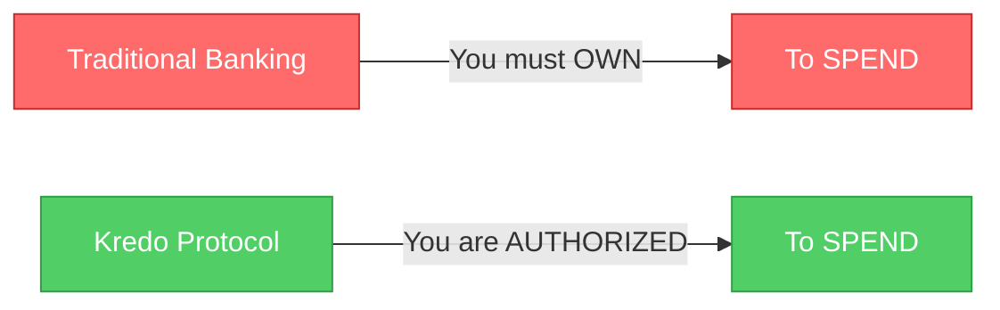

---

## 🏗️ System Architecture (Infrastructure View)

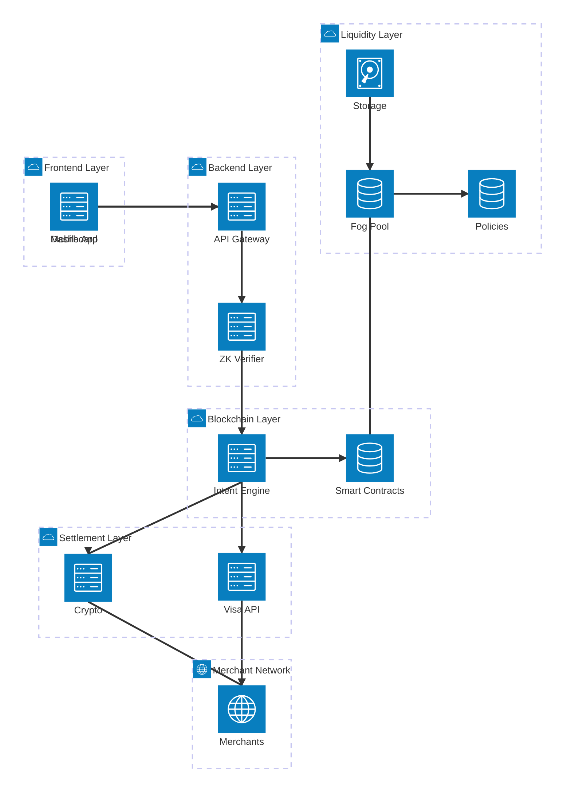

---

## �🌊 Complete Transaction Flow

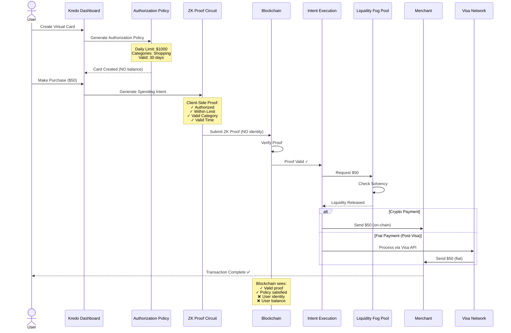

---

## � Layered Architecture (Logical View)

```mermaid
graph TB
    subgraph Application["🖥️ APPLICATION LAYER"]
        Dashboard[Dashboard]
        Mobile[Mobile App]
        API[API]
        SDK[SDK]
    end
    
    subgraph AuthPolicy["🔐 AUTHORIZATION POLICY LAYER"]
        Constraints[Spending Constraints]
        Categories[Category Restrictions]
        TimeRules[Time-Based Rules]
        Security[Security Policies]
    end
    
    subgraph ZKLayer["🔒 ZERO-KNOWLEDGE PROOF LAYER"]
        ProofGen[Client-Side Proof Generation]
        ProofVerify[On-Chain Proof Verification]
        Privacy[Privacy Preservation]
    end
    
    subgraph IntentEngine["⚡ INTENT EXECUTION ENGINE"]
        Validate[Validate Proofs]
        Enforce[Enforce Policies]
        Release[Release Liquidity]
    end
    
    subgraph LiquidityPool["🌊 LIQUIDITY FOG POOL"]
        Capital[Pooled Capital]
        NoAttribution[No Individual Attribution]
        AuthAccess[Authorization-Based Access]
    end
    
    subgraph Settlement["💳 SETTLEMENT LAYER"]
        Crypto[Crypto: On-Chain]
        Fiat[Fiat: Visa API]
    end
    
    Application --> AuthPolicy
    AuthPolicy --> ZKLayer
    ZKLayer --> IntentEngine
    IntentEngine --> LiquidityPool
    LiquidityPool --> Settlement
    
    style Application fill:#4c6ef5,stroke:#364fc7,color:#fff
    style AuthPolicy fill:#7950f2,stroke:#5f3dc4,color:#fff
    style ZKLayer fill:#f06595,stroke:#c2255c,color:#fff
    style IntentEngine fill:#ff6b6b,stroke:#c92a2a,color:#fff
    style LiquidityPool fill:#20c997,stroke:#087f5b,color:#fff
    style Settlement fill:#ffd43b,stroke:#f08c00,color:#000
```

---

## 🔄 Traditional vs Kredo Comparison

```mermaid
graph TB
    subgraph Traditional["❌ TRADITIONAL BANKING"]
        T1[Create Account] --> T2[Deposit Funds]
        T2 --> T3[You Own Balance]
        T3 --> T4[You Secure Wallet]
        T4 --> T5[Balance Tracked On-Chain]
        T5 --> T6[Identity Exposed]
        T6 --> T7[Spend Your Money]
    end
    
    subgraph Kredo["✅ KREDO PROTOCOL"]
        K1[Get Authorized] --> K2[NO Account Created]
        K2 --> K3[NO Balance Owned]
        K3 --> K4[Protocol Manages Liquidity]
        K4 --> K5[NO On-Chain Attribution]
        K5 --> K6[Privacy Preserved]
        K6 --> K7[Spend from Pool]
    end
    
    style Traditional fill:#ff6b6b,stroke:#c92a2a,color:#fff
    style Kredo fill:#51cf66,stroke:#2f9e44,color:#fff
```

---

## 💳 Virtual Card Creation Flow

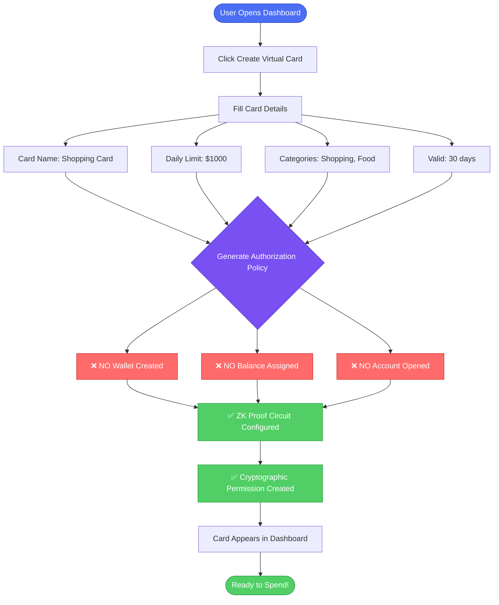

---

## 🛒 Purchase Transaction Flow

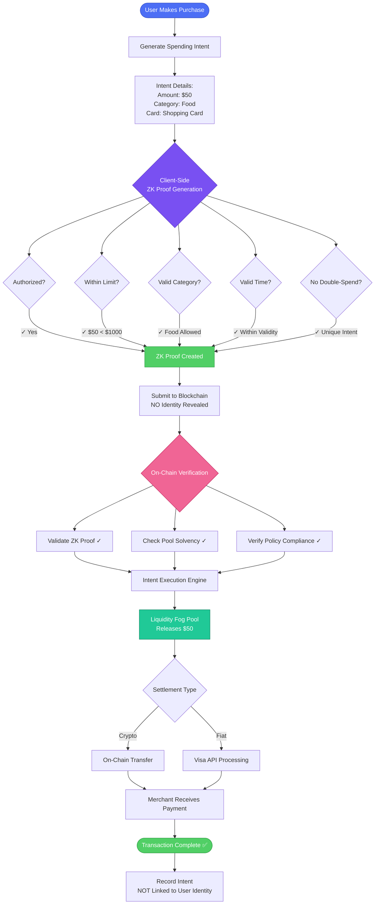

---

## 🌐 Visa Integration Architecture

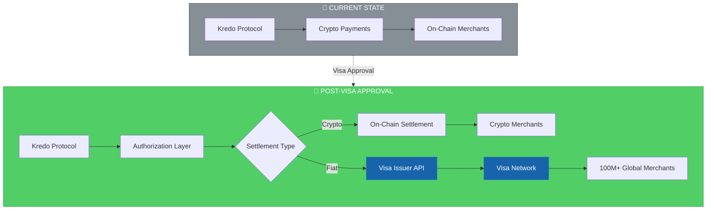

---

## 🔐 Privacy & Security Model

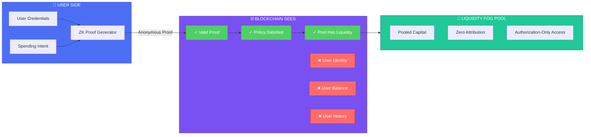

---

## 📊 Liquidity Fog Pool Concept

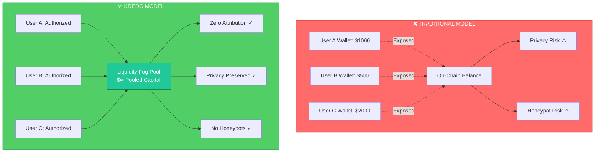

---

## 🎯 Real-World Example: Alice's Travel Card

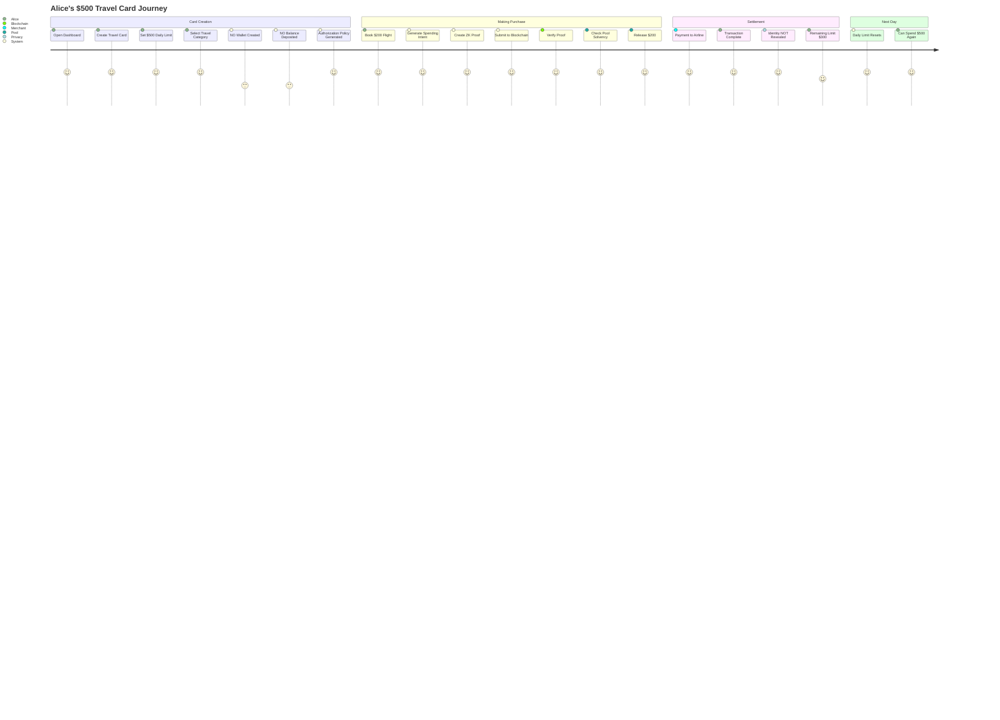

---

## 🚀 The Innovation Stack

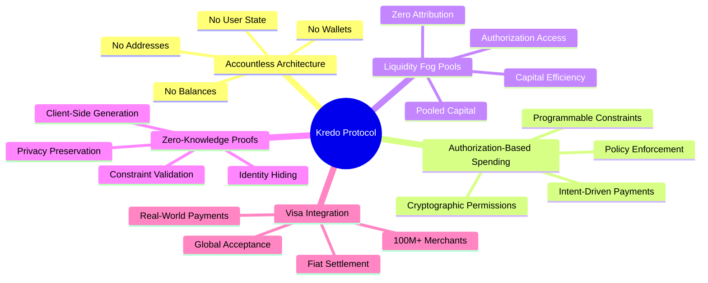

---

## 💡 Key Differentiators

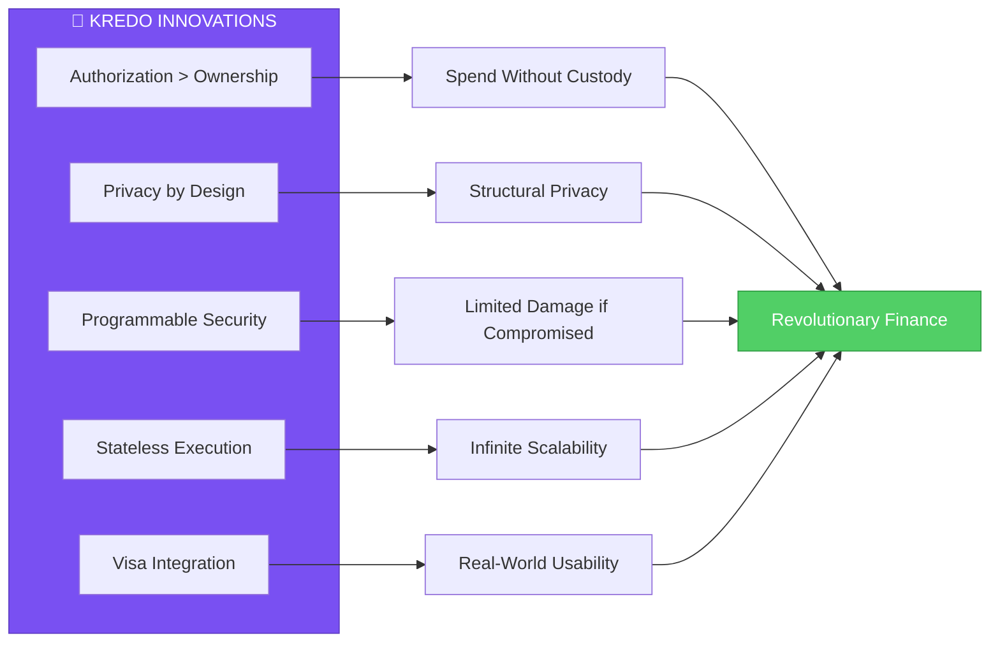

---

## 📈 Roadmap to Visa Integration

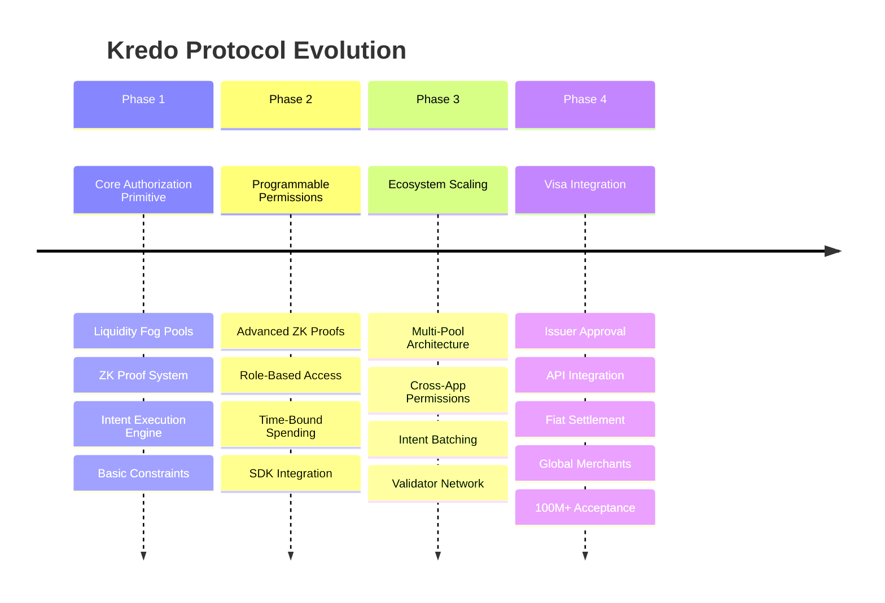

---

## 🎬 Complete User Journey

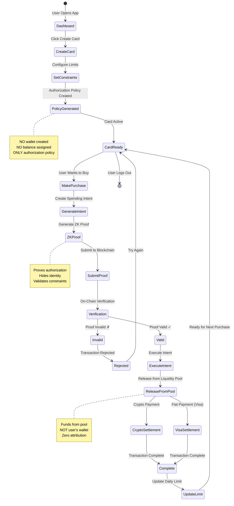

---

## 🌟 The Vision: Banking Without Accounts

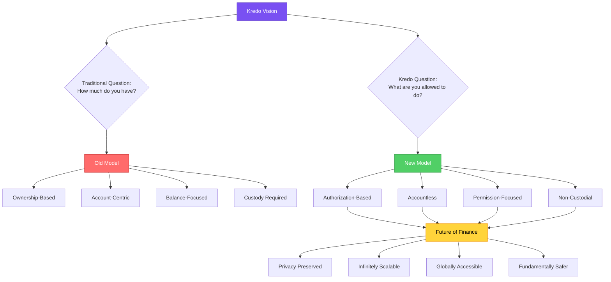

---

## 📢 Share This

Understanding Kredo Protocol is understanding the future of finance.

### **Key Takeaways:**

1. 🔐 You don't need to OWN money to SPEND it
2. ✅ Authorization > Ownership
3. 🔒 Privacy is structural, not optional
4. 🌊 Liquidity is infrastructure, not property
5. 💳 Visa integration brings this to the real world

### **The Revolution:**

From **"How much do you have?"** to **"What are you allowed to do?"**

---

## 🛠️ Built With

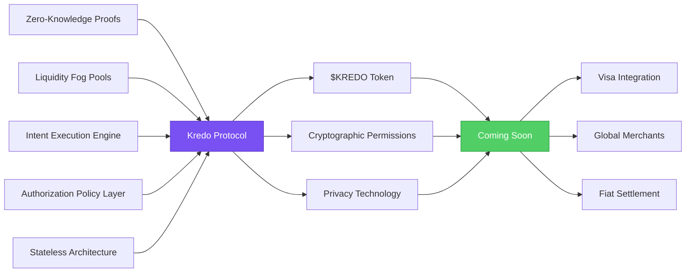

---

*Kredo Protocol: Banking without accounts. Not because accounts were optimized away—but because they were never necessary to begin with.* 🚀
